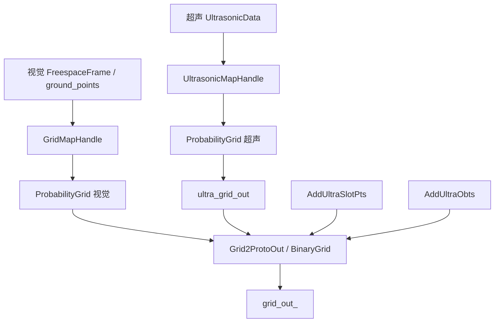
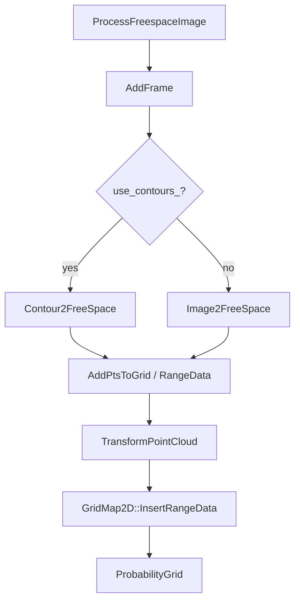
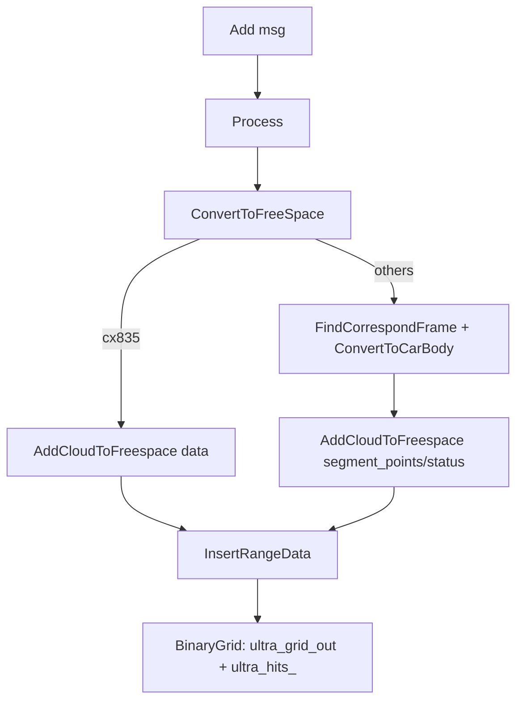
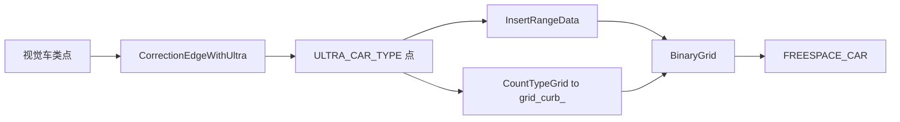
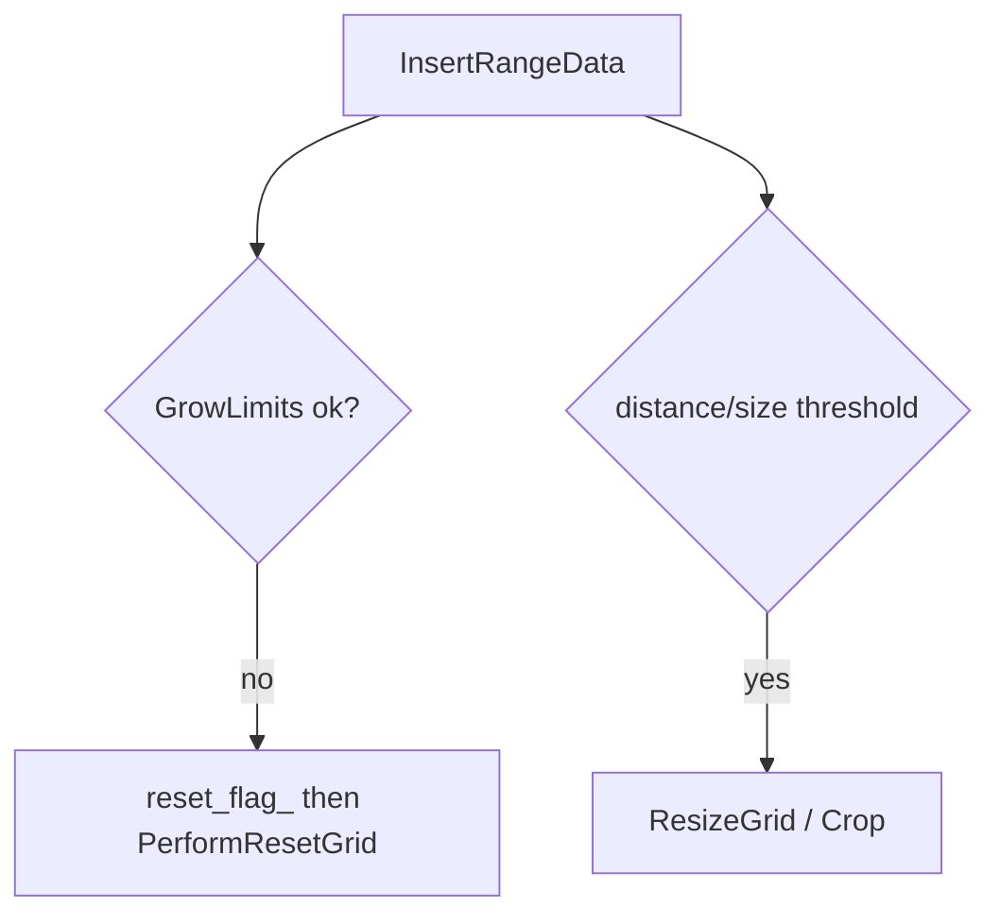

##  栅格地图更新原理与实现（视觉 / 超声 / 输出）

## 0. 范围与目标
- 范围：`apa-core/depends/parking/src/core/mapping/grid` + `apa-core/depends/parking/src/core/interfaces/mapping/ultrasonic_data.*`。
- 目标：解释栅格更新的核心原理、公式与链路；把“视觉更新 / 超声更新 / 输出融合”逐函数对应起来；重点澄清超声车类点与障碍点的路径、刷新机制。

## 1. 原理基础（公式）

### 1.1 坐标到栅格索引（MapLimits）
世界坐标点 $(x, y)$ 映射到栅格索引：

$$
\begin{aligned}
row &= \mathrm{round}\left(\frac{max_y - y}{r} - 0.5\right) \\
col &= \mathrm{round}\left(\frac{max_x - x}{r} - 0.5\right)
\end{aligned}
$$

其中 $r$ 为分辨率，$(max_x, max_y)$ 为地图上边界。对应实现：`MapLimits::GetCellIndex`。

扁平索引（Row-major）：

$$
flat = num_x \cdot col + row
$$

对应实现：`Grid2D::ToFlatIndex`（注意 `num_x * cell_index.y + cell_index.x`）。

栅格中心坐标：

$$
\begin{aligned}
 x_{center} &= max_x - r \cdot (col + 0.5) \\
 y_{center} &= max_y - r \cdot (row + 0.5)
\end{aligned}
$$

对应实现：`MapLimits::GetCellCenter`。

### 1.2 坐标变换（Rigid3f）
刚体变换（车体/相机到世界）：

$$
\mathbf{p}_w = \mathbf{R}\,\mathbf{p}_c + \mathbf{t}
$$

逆变换：

$$
\mathbf{p}_c = \mathbf{R}^{-1}(\mathbf{p}_w - \mathbf{t})
$$

对应实现：`mapping::transform::Rigid3f` 的乘法与 `TransformPointCloud`。

### 1.3 概率更新（Odds/LookupTable）
栅格内部存储的是 **correspondence cost**，与概率 $p$ 的关系：

$$
 p = 1 - c
$$

Odds 定义：

$$
\mathrm{odds}(p) = \frac{p}{1 - p}
$$

更新规则（命中/空闲）：

$$
\mathrm{odds}_t = \mathrm{odds}_{t-1} \cdot \mathrm{odds}_{hit}
\quad\text{或}\quad
\mathrm{odds}_t = \mathrm{odds}_{t-1} \cdot \mathrm{odds}_{miss}
$$

其中：

$$
\mathrm{odds}_{\\text{hit}} = \mathrm{Odds}(\\text{hit\\_probability}), \\quad
\mathrm{odds}_{\\text{miss}} = \mathrm{Odds}(\\text{miss\\_probability})
$$

实现中使用 `ComputeLookupTableToApplyCorrespondenceCostOdds` 预计算查表（`ProbabilityGridRangeDataInserter2D`）。

### 1.4 RangeData 与射线投射（CastRays）
`RangeData = {origin, returns, misses}`。
- `returns`：障碍命中点；`misses`：自由空间点。
- `update_free_space = true`：**只**把 `misses` 端点标记为自由（不投射射线）。
- `update_free_space = false`：对 `returns/misses` 做完整射线投射，沿射线路径写入 miss。

超采样：

$$
resolution_{sup} = \frac{resolution}{1000}
$$

对应实现：`CastRays`，`kSubpixelScale = 1000`。

### 1.5 单次更新保护（Update Marker）
每个 cell 每次 Insert 只允许更新一次：
- `kUpdateMarker = 1 << 15`。
- `ApplyLookupTable` 设置 marker。
- `FinishUpdate` 清除 marker。

对应实现：`ProbabilityGrid::ApplyLookupTable` / `Grid2D::FinishUpdate`。

## 2. 系统整体框架（数据流）

## 3. 视觉栅格更新（原理 + 函数）

### 3.1 视觉更新流程
- 视觉帧由 `AddImage(...)` 入队，`ProcessFreespaceImage()` 拉取。
- `AddFrame(...)` 执行核心栅格更新：
  - `use_contours_ == true`：走 `Contour2FreeSpace`；
  - `use_contours_ == false`：可走 `Image2FreeSpace`（若外部传 raw mask）。
- 若 `use_ultra_ && car_status_ == LOOKING`，调用 `CorrectionEdgeWithUltra` 做超声修正。
- 首帧且已获取相机位置时，会将 `car_edge_pts_` 作为 miss 写入，清理车身周边未知格。

### 3.2 视觉点分类与刷新逻辑
- `AddPtsToGrid` 分类规则（核心）：
  - `PERCEP_VIRTUAL_MISS_TYPE`：直接加入 `misses`。
  - `PERCEP_ROAD_TYPE`：加入 `misses`。
  - 其他障碍类型：默认加入 `returns`。
  - 后视相机 + 某些静态障碍（`CONE_BARREL_TYPE` 等）且不在车中部：转 `misses`。
- “刷新”本质：通过 `miss_table` 逐帧把路径写成自由空间；若某障碍不再命中，会被 miss “刷掉”。
- `use_contours_` 时 `update_free_space = false`（完整射线更新）；不使用轮廓时 `update_free_space = true`（仅 miss 端点）。

### 3.3 超声修正视觉边缘（公式）
对每个超声传感器 $i$：
- 取最近视觉点 $\mathbf{p}_v$，传感器位置 $\mathbf{p}_u$。
- 视觉距离 $d_v = \|\mathbf{p}_v - \mathbf{p}_u\|$，超声测距 $d_u$。
- 理想位置：

$$
\mathbf{p}_{ideal} = \mathbf{p}_u + \frac{d_u}{d_v}(\mathbf{p}_v - \mathbf{p}_u)
$$

- 偏移量（代码中的缩放与经验系数）：

$$
\Delta = \frac{\mathbf{p}_{ideal} - \mathbf{p}_v}{scale} \cdot 0.8
$$

- 实现细节：`delta_x/delta_y` 在车体坐标计算，但写回图像坐标时做了 `x/y` 交换（见 `new_p.x = p.x - delta_y; new_p.y = p.y - delta_x`）。

触发条件（节选）：
- $0.2 < d_u < 2.4$；
- $\lvert d_v - d_u \rvert$ 在阈值内（`connect_dis` 依传感器位置不同）。

### 3.4 视觉相关函数表

| 函数 | 文件 | 作用 / 原理 | 关键输入/输出 |
|---|---|---|---|
| `ProcessFreespaceImage` | `grid_map_handle.cc` | 消费视觉帧队列、触发裁剪与更新 | `freespace_buffer_` → `AddFrame` |
| `AddFrame` | `grid_map_handle.cc` | 单帧视觉更新入口；时间对齐超声 | `ground_points + pose` → `InsertRangeData` |
| `Contour2FreeSpace` | `grid_map_handle.cc` | 轮廓版更新；支持超声修正 | `ground_points` → `RangeData` |
| `Image2FreeSpace` | `grid_map_handle.cc` | raw freespace mask 的更新 | `cv::Mat` → `RangeData` |
| `AddPtsToGrid` | `grid_map_handle.cc` | 点分类为 returns/misses | `Point3f(z=type)` → `RangeData` |
| `CorrectionEdgeWithUltra` | `grid_map_handle.cc` | 超声校正视觉边缘点 | 视觉点 + 超声数据 → `ULTRA_CAR_TYPE` |
| `CountTypeGrid` | `grid_map_handle.cc` | 统计 curb / car 点到 `grid_curb_` | 点 → `grid_curb_` |

## 4. 超声栅格更新（原理 + 函数）

### 4.1 超声更新流程
- `Add(msg)` 入队 → `Process()` 线程消费。
- `ConvertToFreeSpace`：对齐视觉帧（非 cx835），计算 segment_points/status。
- `AddCloudToFreespace`：按传感器写入 RangeData → InsertRangeData。
- `BinaryGrid`：得到 `ultra_grid_out`，同时统计 `ultra_hits_`（用于下一帧超声状态）。

### 4.2 超声点生成与状态规则
- `status == 0` → `returns`（hit）；`status == 1` → `misses`（free）。
- `SamplePoints` 的角度采样：

$$
\Delta\theta = \frac{0.06}{r} \cdot \frac{180}{\pi}
$$

其中 $r$ 为当前超声测距，沿扇区边界采样点。
- `IfCornerUltraAddObts` / `IfSideUltraAddObts` 在泊车或特定条件下强制加入障碍（r 在 0.15~0.45m）。
- `ClusterFramePoint` 用视觉点统计每个传感器的“可信度”，影响 `single_status`（最终 status）。

### 4.3 超声一致性过滤（抑制孤立 hit）
`UltrasonicMapHandle::AddCloudToFreespace(segment_points, status)`：
- 若当前 `grid_out_` 某 cell 已是障碍（`0 < cell < 0.8*max`），则保留该 hit；
- 同一传感器内其余 hit 会被转为 miss；
- 目的：只保留与已有障碍一致的超声点，降低噪声。

### 4.4 cx835 专用路径
`ConvertToFreeSpace` 在 `type_ == "cx835"` 时：
- 使用 `UltrasonicData::obs_pts_` 直接作为 `returns`；
- 将视觉障碍 `gridmap_obs_pts_` 投影到 AVM mask，若 `raw_data_[index-1] > 3`，补充 `misses` 清障。

### 4.5 超声相关函数表

| 函数 | 文件 | 作用 / 原理 | 关键输入/输出 |
|---|---|---|---|
| `Process` | `ultrasonic_map_handle.cc` | 消费超声队列，触发更新 | `ultrasonic_buffer_` |
| `ConvertToFreeSpace` | `ultrasonic_map_handle.cc` | 生成 `segment_points/status` 并写入 | `UltrasonicData` → `AddCloudToFreespace` |
| `FindCorrespondFrame` | `ultrasonic_map_handle.cc` | 时间对齐视觉帧（非 cx835） | `timestamp` → `FreespaceFrame` |
| `AddCloudToFreespace` | `ultrasonic_map_handle.cc` | 按传感器写 RangeData 并 Insert | `segment_points/status` → `InsertRangeData` |
| `BinaryGrid` | `ultrasonic_map_handle.cc` | 超声栅格阈值化 + 统计 `ultra_hits_` | `grid_out_` → `ultra_hits_` |
| `ConvertToCarBody` | `ultrasonic_data.cc` | 生成车体坐标超声点 | `FreespaceFrame + Ultra` → `segment_points/status` |
| `SamplePoints` | `ultrasonic_data.cc` | 生成扇区点并设置 hit/miss | `pl/pr/r` → `points/status` |

## 5. 超声车类点与障碍点

### 5.1 超声车类点（ULTRA_CAR_TYPE → FREESPACE_CAR）
路径：
1. 视觉点（车类）进入 `CorrectionEdgeWithUltra`；
2. 满足距离条件后生成 `ULTRA_CAR_TYPE` 修正点；
3. `AddPtsToGrid` 作为 `returns` 写入概率栅格；
4. `CountTypeGrid` 将车类点累计到 `grid_curb_` 通道1；
5. `BinaryGrid` 中：若通道1计数 ≥ 5 且该 cell 为障碍 → 升级为 `FREESPACE_CAR`。
> 备注：该路径依赖 `out_grid_type_` 开启，否则 `grid_curb_` 不统计，车类只表现为普通障碍。

### 5.2 外部注入车类点（FREESPACE_ULTRA_CAR）
- `AddUltraSlotPts` → `added_ultraslot_grid_`；
- `BinaryGrid` 末尾直接覆盖 `FREESPACE_ULTRA_CAR`；
- 不影响概率栅格，仅影响输出层。

### 5.3 超声障碍点
- **内部超声障碍**：
  - `UltrasonicMapHandle::BinaryGrid` 生成 `ultra_grid_out`；
  - `Grid2ProtoOut(add_ultra=true)` 中把 `ultra_grid_out` 的障碍覆盖为 `FREESPACE_ULTRA`。
- **外部注入障碍**：
  - `AddUltraObts` → `added_ultra_obts_`；
  - `BinaryGrid` 末尾覆盖为 `FREESPACE_ULTRA_OBTS`（受 `enable_send_ultra_obs_` 控制）。

## 6. 输出融合与刷新（BinaryGrid）

### 6.1 输出融合步骤
`Grid2ProtoOut` → `BinaryGrid`：
1. 概率阈值化：
   - `cell == 0` → `FREESPACE_UNKOWN`；
   - `0 < cell < limit_obt` → `FREESPACE_OBSTACLE`；
   - 其他 → `FREESPACE_FEREESPACE`。
2. 叠加 `grid_curb_`：
   - 通道0 → `FREESPACE_CURB`；
   - 通道1 → `FREESPACE_CAR`。
3. 车体矩形覆盖：车体范围内的 `UNKOWN` → `FREESPACE_FEREESPACE`。
4. 融合 `ultra_grid_out`：障碍覆盖为 `FREESPACE_ULTRA`。
5. 噪声过滤：孤立障碍/超声车格降级为可行驶。
6. 末尾强制覆盖：
   - `added_ultraslot_grid_` → `FREESPACE_ULTRA_CAR`；
   - `added_ultra_obts_` → `FREESPACE_ULTRA_OBTS`。

### 6.2 刷新机制说明
- **投射型更新（returns/misses）**：持续命中才能保持；没有命中则被 miss 逐步刷新为自由。
- **输出层覆盖（ultraslot/ultra_obts）**：只影响最终输出；若外部不再提供点，列表会被清空，输出层不再覆盖。
- **统计层（grid_curb_）**：在 Resize/Reset 时清空重建。

## 7. 地图裁剪与重置（建图生命周期）
- 视觉线程：`ProcessFreespaceImage` 根据位移与栅格尺寸触发 `ResizeGrid` 裁剪。
  触发条件包含：`distance >= sub_range_` 或尺寸超过 35m，且处于 `LOOKING` 状态。
- 超声线程：`ConvertToFreeSpace` 根据累计位移与 `map_size` 触发 `ResizeGrid`。
- 当 `InsertRangeData` 因 `GrowLimits` 失败时置 `reset_flag_`，由 `PerformResetGrid` 重建地图与缓冲。

## 8. 核心函数与原理对照（汇总表）

### 8.1 栅格/概率核心

| 函数 | 文件 | 作用 / 原理 |
|---|---|---|
| `MapLimits::GetCellIndex` | `map_limits.h` | 世界坐标到栅格索引公式 |
| `Grid2D::ToFlatIndex` | `grid_2d.h` | 二维索引转扁平索引 |
| `Grid2D::GrowLimits` | `grid_2d.cc` | 地图动态扩展；超过阈值返回 false |
| `ProbabilityGridRangeDataInserter2D::Insert` | `probability_grid_range_data_inserter_2d.cc` | 调用 `CastRays` + `FinishUpdate` |
| `CastRays` | `probability_grid_range_data_inserter_2d.cc` | 核心射线投射与 hit/miss 更新 |
| `ProbabilityGrid::ApplyLookupTable` | `probability_grid.cc` | odds 查表更新 + update marker |
| `GridMap2D::InsertRangeData` | `grid_map_2d.cc` | 统一插入 RangeData |

### 8.2 视觉更新

| 函数 | 文件 | 作用 / 原理 |
|---|---|---|
| `Image2RangeData` | `grid_map_handle.cc` | 由 mask 像素生成 returns/misses |
| `ReduceContour` / `Contour2RangeData` | `grid_map_handle.cc` | 轮廓抽稀与边缘点提取 |
| `CorrectionEdgeWithUltra` | `grid_map_handle.cc` | 超声修正视觉车类边缘 |
| `AddPtsToGrid` | `grid_map_handle.cc` | 视觉点类型 → returns/misses |
| `Contour2FreeSpace` | `grid_map_handle.cc` | 轮廓版 RangeData 插入 |
| `CountTypeGrid` | `grid_map_handle.cc` | 统计 curb / car 类型 |
| `Grid2ProtoOut` / `BinaryGrid` | `grid_map_handle.cc` | 概率栅格 → 语义栅格 |

### 8.3 超声更新

| 函数 | 文件 | 作用 / 原理 |
|---|---|---|
| `ConvertToFreeSpace` | `ultrasonic_map_handle.cc` | 生成超声点并插入栅格 |
| `AddCloudToFreespace` | `ultrasonic_map_handle.cc` | RangeData 组装与插入 |
| `BinaryGrid` | `ultrasonic_map_handle.cc` | 超声概率 → 语义 + 统计 `ultra_hits_` |
| `ClusterFramePoint` | `ultrasonic_data.cc` | 用视觉点校正超声状态 |
| `ConvertToCarBody` | `ultrasonic_data.cc` | 生成扇区采样点与 status |
| `SamplePoints` | `ultrasonic_data.cc` | 扇区点采样与 hit/miss 判定 |

### 8.4 输出覆盖与外部注入

| 函数 | 文件 | 作用 / 原理 |
|---|---|---|
| `AddUltraSlotPts` | `grid_map_handle.cc` | 外部车类点覆盖输出 |
| `AddUltraObts` | `grid_map_handle.cc` | 外部超声障碍覆盖输出 |

## 9. 关键参数与阈值（代码值）

| 参数 | 位置 | 数值 / 说明 |
|---|---|---|
| `grid_option_.resolution` | `GridMapHandle / UltrasonicMapHandle` | 0.1 m |
| `hit_probability` | `GridMapHandle` | 0.62 |
| `miss_probability` | `GridMapHandle` | 0.44 |
| `hit_probability` | `UltrasonicMapHandle` | 0.54 |
| `miss_probability` | `UltrasonicMapHandle` | 0.48 |
| `limit_obt` | `BinaryGrid` | $0.4 \times 32767$ |
| `limit_free` | `BinaryGrid` | $0.35 \times 32767$ |
| `connect_dis` | `CorrectionEdgeWithUltra` | 前后 0.5 / 侧面 1.2 / 默认 0.7 |
| 超声距离有效范围 | `CorrectionEdgeWithUltra` | $0.2 < d < 2.4$ |
| 超声采样角步长 | `SamplePoints` | $\Delta\theta = 0.06/r$（度） |

## 10. 关联文件清单
- `grid_map_handle.h/.cc`
- `ultrasonic_map_handle.h/.cc`
- `grid_map_2d.h/.cc`
- `probability_grid_range_data_inserter_2d.h/.cc`
- `probability_grid.h/.cc`
- `grid_2d.h/.cc`
- `map_limits.h/.cc`
- `probability_values.h/.cc`
- `ultrasonic_data.h/.cc`
